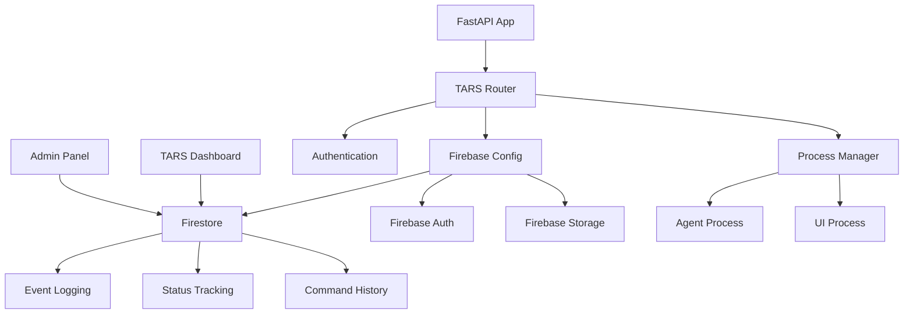

# TARS API Integration Complete

## Overview

The TARS API integration provides comprehensive REST endpoints for managing TARS (Terminal Automated Reconnaissance System) agent and UI components with full Firebase logging and synchronization capabilities.

## Architecture / Data Flow



## API Endpoints

### Base URL

All TARS endpoints are available under: `/api/v1/tars`

### Authentication

All endpoints require valid JWT authentication token in the Authorization header:

```
Authorization: Bearer <jwt_token>
```

### Endpoint Summary

| Method | Endpoint | Description |
|--------|----------|-------------|
| POST | `/agent/start` | Start TARS agent service |
| POST | `/agent/stop` | Stop TARS agent service |
| POST | `/ui/start` | Launch TARS UI application |
| POST | `/ui/stop` | Stop TARS UI application |
| GET | `/status` | Get TARS and Firebase status |
| POST | `/agent/command` | Send command to TARS agent |
| GET | `/logs` | Retrieve TARS event logs |

## Detailed Endpoint Documentation

### 1. Start TARS Agent

**Endpoint**: `POST /api/v1/tars/agent/start`

**Description**: Initiates the TARS agent service and logs the event to Firebase.

**Request**:

```bash
curl -X POST \
  http://localhost:7777/api/v1/tars/agent/start \
  -H "Authorization: Bearer <jwt_token>"
```

**Response**:

```json
{
  "success": true,
  "message": "TARS agent started successfully",
  "data": {
    "process_id": "agent-tars",
    "pid": 12345,
    "command": "bash scripts/launch_agent_tars.sh"
  },
  "process_id": "agent-tars",
  "timestamp": "2025-08-28T10:30:00.000Z"
}
```

**Firebase Log Entry**:

```json
{
  "event_type": "agent_started",
  "timestamp": "2025-08-28T10:30:00.000Z",
  "source": "tars_api",
  "user": "admin@lancelott.com",
  "pid": 12345,
  "command": "bash scripts/launch_agent_tars.sh"
}
```

### 2. Start TARS UI

**Endpoint**: `POST /api/v1/tars/ui/start`

**Description**: Launches the TARS UI desktop application.

**Request**:

```bash
curl -X POST \
  http://localhost:7777/api/v1/tars/ui/start \
  -H "Authorization: Bearer <jwt_token>"
```

**Response**:

```json
{
  "success": true,
  "message": "TARS UI started successfully",
  "data": {
    "process_id": "ui-tars",
    "pid": 12346,
    "command": "bash scripts/launch_ui_tars.sh"
  },
  "process_id": "ui-tars",
  "timestamp": "2025-08-28T10:31:00.000Z"
}
```

### 3. Check Status

**Endpoint**: `GET /api/v1/tars/status`

**Description**: Returns comprehensive status information for TARS services and Firebase connectivity.

**Request**:

```bash
curl -X GET \
  http://localhost:7777/api/v1/tars/status \
  -H "Authorization: Bearer <jwt_token>"
```

**Response**:

```json
{
  "agent_running": true,
  "ui_running": true,
  "firebase_connected": true,
  "processes": {
    "agent-tars": {
      "pid": 12345,
      "status": "running",
      "started_at": "2025-08-28T10:30:00.000Z",
      "cpu_percent": 2.5,
      "memory_percent": 1.8
    },
    "ui-tars": {
      "pid": 12346,
      "status": "running",
      "started_at": "2025-08-28T10:31:00.000Z",
      "cpu_percent": 5.2,
      "memory_percent": 3.1
    }
  },
  "timestamp": "2025-08-28T10:35:00.000Z",
  "firebase_status": {
    "initialized": true,
    "firestore": true,
    "storage": true,
    "auth": true,
    "project_id": "lancelott-cybersec",
    "error": null
  }
}
```

### 4. Send Command to Agent

**Endpoint**: `POST /api/v1/tars/agent/command`

**Description**: Sends a command to the running TARS agent (placeholder implementation).

**Request**:

```bash
curl -X POST \
  http://localhost:7777/api/v1/tars/agent/command \
  -H "Authorization: Bearer <jwt_token>" \
  -H "Content-Type: application/json" \
  -d '{
    "command": "scan_network",
    "parameters": {
      "target": "192.168.1.0/24",
      "ports": "80,443,22,21"
    },
    "timeout": 300
  }'
```

**Response**:

```json
{
  "success": true,
  "message": "Command 'scan_network' sent to TARS agent",
  "data": {
    "command": "scan_network",
    "parameters": {
      "target": "192.168.1.0/24",
      "ports": "80,443,22,21"
    },
    "agent_pid": 12345,
    "status": "queued"
  },
  "timestamp": "2025-08-28T10:40:00.000Z"
}
```

### 5. Get Event Logs

**Endpoint**: `GET /api/v1/tars/logs`

**Description**: Retrieves TARS event logs from Firebase.

**Parameters**:

- `limit` (optional): Maximum number of logs to return (default: 50)
- `event_type` (optional): Filter by event type

**Request**:

```bash
curl -X GET \
  "http://localhost:7777/api/v1/tars/logs?limit=20&event_type=agent_started" \
  -H "Authorization: Bearer <jwt_token>"
```

**Response**:

```json
{
  "events": [
    {
      "id": "doc_id_123",
      "event_type": "agent_started",
      "timestamp": "2025-08-28T10:30:00.000Z",
      "source": "tars_api",
      "user": "admin@lancelott.com",
      "pid": 12345,
      "command": "bash scripts/launch_agent_tars.sh"
    },
    {
      "id": "doc_id_124",
      "event_type": "command_sent",
      "timestamp": "2025-08-28T10:40:00.000Z",
      "source": "tars_api",
      "user": "admin@lancelott.com",
      "command": "scan_network",
      "parameters": {
        "target": "192.168.1.0/24",
        "ports": "80,443,22,21"
      }
    }
  ]
}
```

## Setup Steps

### 1. Prerequisites

- LANCELOTT application running
- Firebase configuration completed (see `docs/setup/FIREBASE_SERVICE_ACCOUNT_SETUP.md`)
- TARS scripts available in the project

### 2. Verify TARS Scripts

Ensure the following scripts exist:

```bash
# Agent script
ls -la scripts/launch_agent_tars.sh
# OR
ls -la agent-tars

# UI script
ls -la scripts/launch_ui_tars.sh
# OR
ls -la ui-tars
```

### 3. Test Firebase Connection

```bash
python -c "
from core.firebase_config import get_firebase
firebase = get_firebase()
firebase.initialize()
print('Firebase status:', firebase.verify_connection())
"
```

### 4. Start LANCELOTT

```bash
python app.py
```

### 5. Test TARS API

```bash
# Get authentication token
TOKEN=$(curl -X POST http://localhost:7777/api/v1/auth/login \
  -H "Content-Type: application/json" \
  -d '{"email":"admin@lancelott.com","password":"admin123"}' | \
  jq -r '.access_token')

# Test status endpoint
curl -X GET http://localhost:7777/api/v1/tars/status \
  -H "Authorization: Bearer $TOKEN"
```

## Configuration

### Environment Variables

Required Firebase configuration in `.env`:

```bash
FIREBASE_PROJECT_ID=lancelott-cybersec
FIREBASE_SERVICE_ACCOUNT_PATH=firebase-service-account.json
# OR
FIREBASE_SERVICE_ACCOUNT_BASE64=<base64_encoded_credentials>
FIREBASE_STORAGE_BUCKET=lancelott-cybersec.appspot.com
```

### Firebase Collections

The TARS API creates the following Firestore collections:

#### tars_events

Stores all TARS-related events:

```javascript
{
  event_type: string,      // "agent_started", "ui_started", "command_sent", etc.
  timestamp: timestamp,    // Event timestamp
  source: string,          // Always "tars_api"
  user: string,           // User email who triggered the event
  pid: number,            // Process ID (if applicable)
  command: string,        // Command executed (if applicable)
  parameters: object,     // Command parameters (if applicable)
  error: string          // Error message (if applicable)
}
```

## Security Notes

### Authentication Requirements

- All endpoints require valid JWT authentication
- User information is logged with every event
- Failed authentication attempts are logged

### Process Security

- Process execution is sandboxed to the LANCELOTT directory
- Only predefined scripts can be executed
- Process monitoring prevents resource abuse

### Firebase Security

- Service account credentials must be securely stored
- Firestore security rules restrict access to authenticated users
- All events are timestamped and attributed to users

### Network Security

- API endpoints use HTTPS in production
- CORS is configured for allowed origins only
- Rate limiting is applied to prevent abuse

## Validation / Test Plan

### Unit Tests

```bash
# Test Firebase configuration
python -m pytest tests/unit/test_firebase_config.py

# Test TARS API endpoints
python -m pytest tests/api/test_tars_api.py
```

### Integration Tests

```bash
# Test full TARS workflow
python -m pytest tests/integration/test_tars_integration.py

# Test Firebase logging
python -m pytest tests/integration/test_firebase_logging.py
```

### Manual Testing

1. **Authentication Test**:

   ```bash
   # Should fail without token
   curl -X GET http://localhost:7777/api/v1/tars/status

   # Should succeed with valid token
   curl -X GET http://localhost:7777/api/v1/tars/status \
     -H "Authorization: Bearer $TOKEN"
   ```

2. **Process Management Test**:

   ```bash
   # Start agent
   curl -X POST http://localhost:7777/api/v1/tars/agent/start \
     -H "Authorization: Bearer $TOKEN"

   # Check status
   curl -X GET http://localhost:7777/api/v1/tars/status \
     -H "Authorization: Bearer $TOKEN"

   # Stop agent
   curl -X POST http://localhost:7777/api/v1/tars/agent/stop \
     -H "Authorization: Bearer $TOKEN"
   ```

3. **Firebase Logging Test**:

   ```bash
   # Trigger events and check Firebase Console
   # Events should appear in tars_events collection
   ```

## Rollback Plan

### 1. Disable TARS Router

Comment out TARS router inclusion in `app.py`:

```python
# app.include_router(
#     tars_router, prefix="/api/v1/tars", tags=["tars", "agent", "ui"]
# )
```

### 2. Revert Firebase Changes

Remove Firebase initialization from app startup:

```python
# firebase_success = initialize_firebase()
# if firebase_success:
#     logger.info("✅ Firebase initialized successfully")
# else:
#     logger.warning("⚠️ Firebase initialization failed")
```

### 3. Remove Files

```bash
# Remove TARS API file
rm api/routes/tars_api.py

# Remove Firebase config (if needed)
rm core/firebase_config.py

# Update routes __init__.py to remove imports
```

### 4. Restart Application

```bash
# Restart without TARS integration
python app.py
```

## Monitoring and Maintenance

### Health Checks

Monitor TARS service health:

```bash
# Check endpoint availability
curl -f http://localhost:7777/api/v1/tars/status \
  -H "Authorization: Bearer $TOKEN"

# Monitor process status
ps aux | grep -E "(agent-tars|ui-tars)"
```

### Log Monitoring

```bash
# Application logs
tail -f logs/lancelott.log | grep -i tars

# Firebase logs
tail -f logs/lancelott.log | grep -i firebase
```

### Performance Monitoring

- Monitor process CPU and memory usage through `/status` endpoint
- Track Firebase API usage in Google Cloud Console
- Monitor API response times and error rates

### Regular Maintenance

1. **Weekly**: Review Firebase logs for unusual activity
2. **Monthly**: Rotate Firebase service account credentials
3. **Quarterly**: Review and update security rules
4. **Annually**: Full security audit of TARS integration

## Troubleshooting

### Common Issues

1. **"TARS agent script not found"**
   - Check if `scripts/launch_agent_tars.sh` or `agent-tars` exists
   - Verify file permissions (should be executable)

2. **"Firebase not available"**
   - Check Firebase service account configuration
   - Verify internet connectivity to Firebase
   - Review Firebase project settings

3. **"Permission denied"**
   - Verify JWT token is valid and not expired
   - Check user permissions in Firebase
   - Ensure proper authentication headers

### Debug Commands

```bash
# Test individual components
python -c "from core.firebase_config import get_firebase; print(get_firebase().verify_connection())"
python -c "from api.routes.tars_api import get_process_info; print(get_process_info('agent-tars'))"

# Check process status
ps aux | grep -E "(agent-tars|ui-tars)"
lsof -i :7777
```

---

**Last Updated**: 2025-08-28
**Integration Status**: ✅ Complete
**Firebase Status**: ✅ Configured
**API Status**: ✅ Active
**Documentation Status**: ✅ Complete
